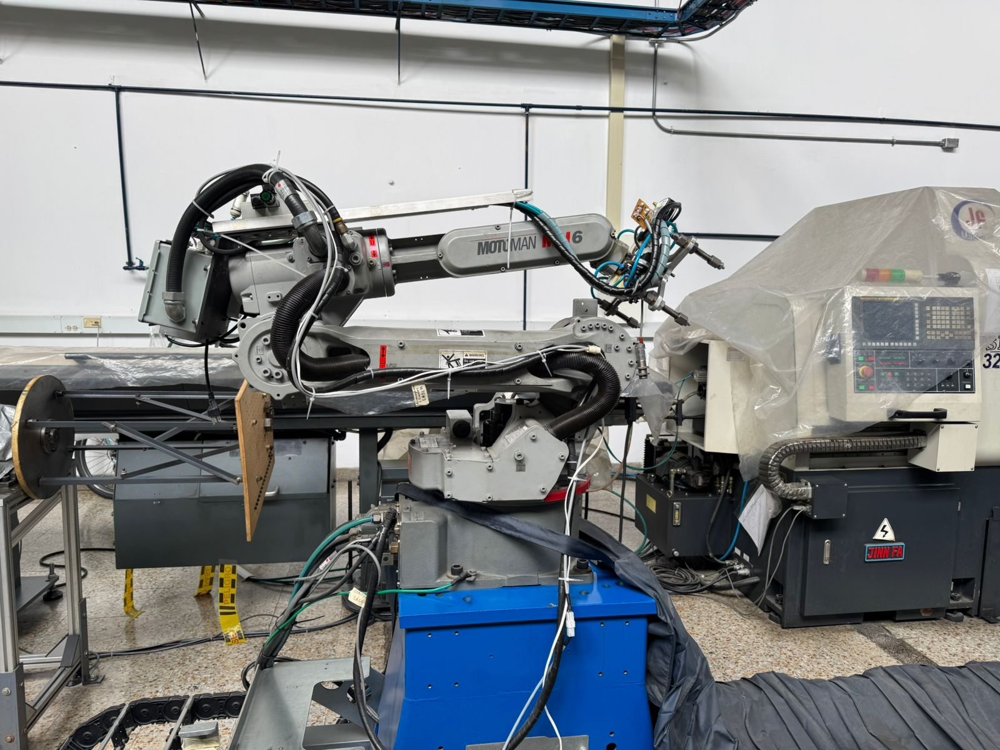
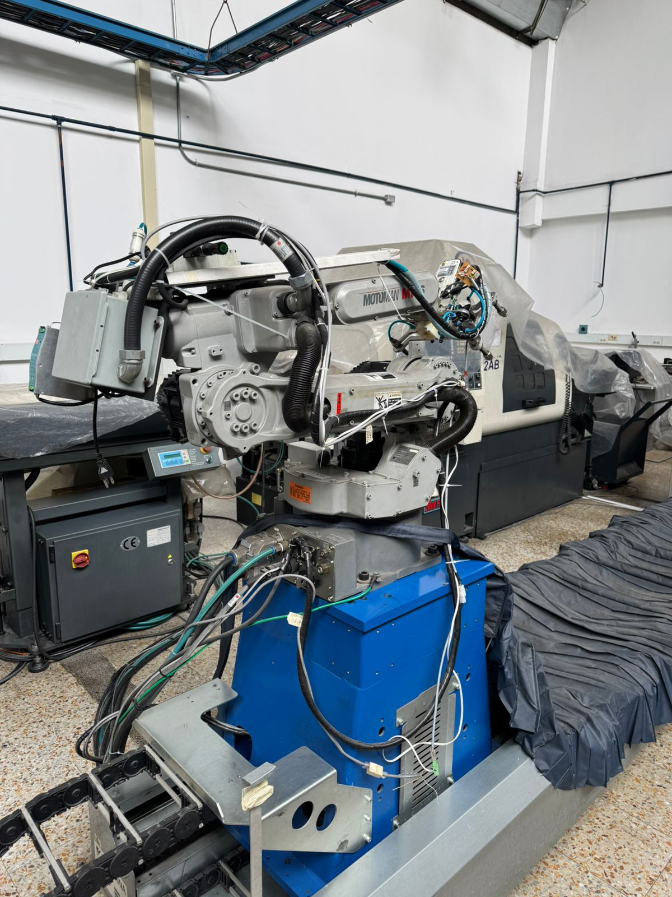
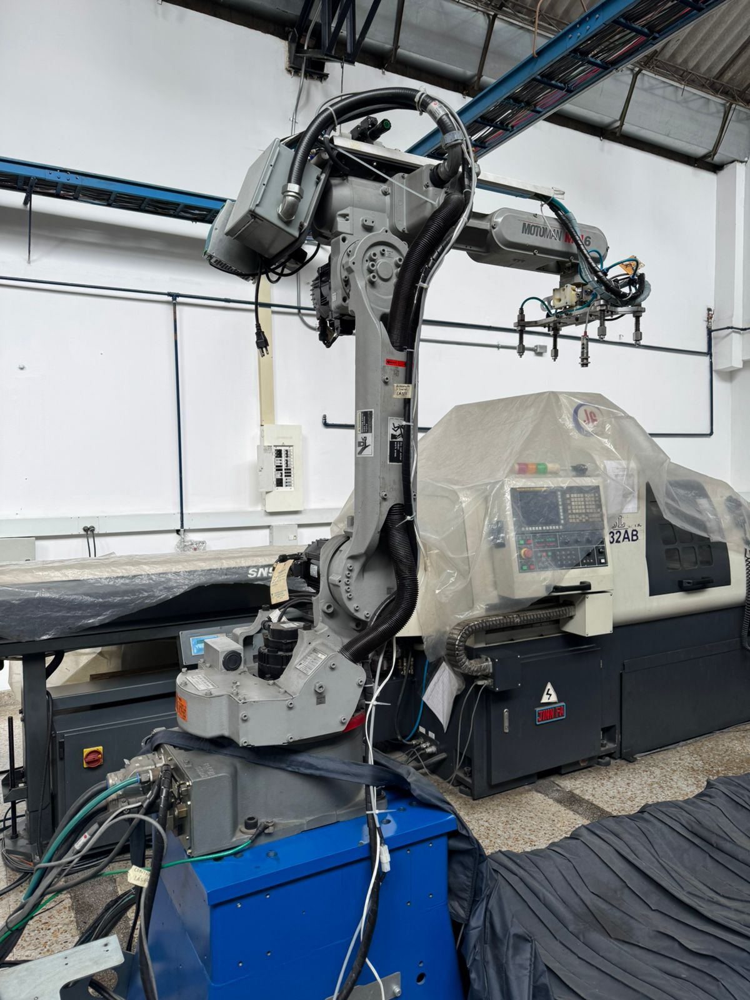
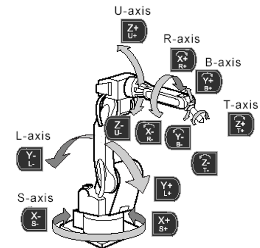
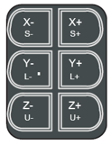
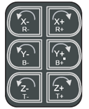
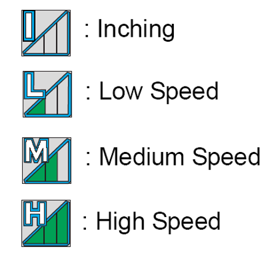
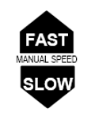

# Robotica 2025-1 Laboratorio 3

En este repositorio analizaremos y explicaremos las principales diferencias que tienen los manipuladores Motoman MH6 y el IRB140 de ABB, ademas de la comparativa entre los sistemas de desarrollo que usan cada uno para sus simulaciones, RoboDK y RobotStudio. Veremos tambien caracteristicas particulares del robot Motoman MH6 como su velocidad, modos de manejo y su uso manual y remoto.

## Archivos del repositorio
- Lab03_TovarOspina.rdk: Proyecto completo realizado en RoboDK
- RosPolar.py: Scrip diseñado para dibujar una rosa polar en un cuerpo (work-object) determinado.
- README.md: este documento.
- images: carpeta de archivos de imágen usada en README.md.
- video: carpeta donde se encuentra el video de la simulación y la prueba con el robot

## Contenidos
- [Cuadro comparativo entre los dos manipuladores](#cuadro-comparativo)
- [Posiciones de Home](#posiciones-de-home)
- [Movimientos manuales](#movimientos-manuales)
- [Niveles de velocidad](#niveles-de-velocidad)
- [RoboDK](#robodk)
- [Código](#código)
- [Video de implementación](#video-simulación-e-implementación)

## Cuadro Comparativo
| **Especificación** | **Motoman MH6** | **ABB IRB 140** |
|---------------------|-----------------|----------------|
| **Marca** | Yaskawa Motoman | ABB Robotics |
| **Controlador** | DX100 | IRC5 |
| **Carga útil (Payload máximo)** | 6 kg | 6 kg |
| **Alcance máximo (Radio de trabajo)** | 1,420 mm | 810 mm |
| **Grados de libertad (DOF)** | 8 ejes (6 del brazo (únicamente) | 6 ejes |
| **Peso del robot** | 130 kg | 98 kg |
| **Rango de movimientos por eje** | S: ±180° L: +155°/-90° U: +150°/-65° R: ±180° B: ±125° T: ±360° | Axis 1: ±160° Axis 2: +110°/-110° Axis 3: +250°/-160° Axis 4: ±200° Axis 5: ±140° Axis 6: ±400° |
| **Velocidad máxima** | Hasta 187°/s | Hasta 450°/s |
| **Software de simulación** | RoboDK, MotoSim | RobotStudio |

## Posiciones de HOME
El manipulador Motoman MH6 tiene guardadas dos configuraciones de referencia (home) que nos permiten garantizar un buen uso de este. Haremos una comparación de estas posiciones y definiremos cual es mejor:

### Home 1:

> Posición de HOME 1.

En esta posición vemos que el robot tiene todas sus articulaciones lo mas cerca posible a su sistema de coordenadas base, el cual se encuentra en la articulacion 1 (la que se ve mas abajo de la imagen). Esta posición permite que el robot ocupe un menor espacio.

### Home 2:

> Posición de HOME 2.

A diferencia de la anterior, en esta posicion vemos una postura mucho mas amplia, con el efector final posicionado de forma que este apunta hacia abajo a una altura determinada por el segundo eslabón. Ademas que su distancia de la base del sistema es aproximadamente la hipotenusa generada por los eslabones 2, 3 y 4, que generan un triangulo rectangulo.

### ¿Cuál es mejor?
Esta pregunta depende mucho del contexto en el que se hace, pues si se requiere realizar un proyecto, algún trabajo u operación, la posición 2 es mucho mejor, pues dispone sus articulaciones mejor hacia un objeto que se encuentre frente al manipulador. Sin embargo, si se requiere simplemente trasladar el robot a algún lugar, o simplemente se quiere almacenar, la posición 1 es mucho mejor, pues es mucho mas compacta.

## Movimientos manuales
El robot Motoman MH6 dispone de un controlador DX100, que tiene a disposicion botones para cada uno de los ejes de libertad. La marca YASKAWA tiene una nomenclatura especifica para poder identificar cada una de las articulaciones y podremos verlas en la siguiente imagen:

Para el movimiento de las primeras 3 articulaciones o el movimiento en cada uno de los ejes dispone del siguiente teclado:

> Teclado para mover primeros 3 ejes y lineal en ejes X, Y y Z.

Por otra parte, para mover las ultimas tres articulaciones(mas alejadas de la base) o el movimiento rotacional, en cada uno de los ejes, dispone del siguiente teclado:

> Teclado para mover los ultimos 3 ejes y las rotaciones en X, Y y Z.

## Niveles de velocidad
El manipulador dispone de 4 niveles de velocidad en la forma automatica, y tres botones que permiten cambiar la velocidad en la forma manual. En el modo automatico se pueden diferenciar de la siguiente forma:

> Formas de velocidad automatica.

Por la parte manual tiene tres botones que se distribuyen como se muestra en la imagen. Estos deben ser presionados constantemente mientras se manipula el robot si deseamos alguna de estas velocidades, sino, se usa la que tiene por defecto.

> Botones para cambiar velocidad.

## RoboDK

### RoboDK vs. RobotStudio

## Código
El codigo implementado en python realiza una conexion al robot por medio de la IP del controlador, una vez realizada la conexión, el codigo realiza un mapedo de ubicaciones a partir de la formula de una rosa polar donde va creando target's que va a seguir el manipulador, una vez terminada la rosa, dibuja las iniciales de los integrantes del grupo, para luego terminar en una posición de HOME determinada por los integrantes.

[Código en python](src/RosPolar.py)

## Video: simulación e implementación
Se presenta la simulación e implementación correspondientes a lo descrito anteriormente en los siguientes enlaces de YouTube: 
- [Simulación](https://youtu.be/0AYZHtmjUtQ)
- [Demostración](https://youtu.be/n1M_4gDCe98)
